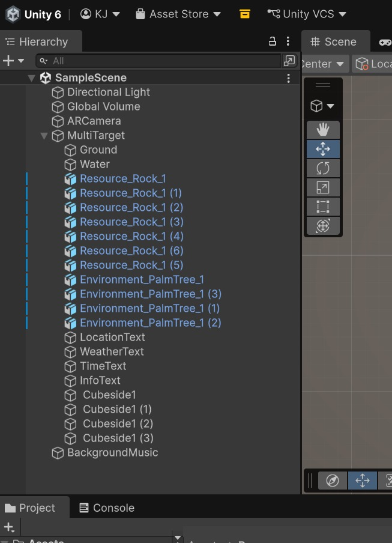
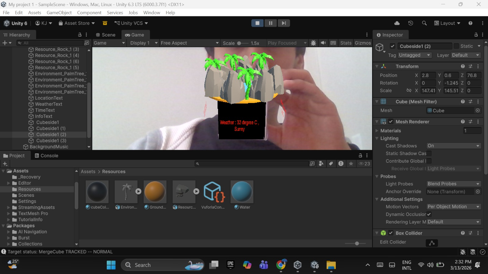

# AR-KnickKnack-Bimmah-Sinkhole
Augmented Reality Knick-Knack built with Unity and Vuforia engine that reacreates Bimmah Sinkhole( Oman ) on a merge cube using MultiTarget tracking

# AR Knick-Knack: Bimmah Sinkhole (Oman)

## Project Overview
This project is an Augmented Reality knick-knack created using Unity and the Vuforia Engine. The AR scene represents Bimmah Sinkhole in Oman and appears on top of a Merge Cube using MultiTarget tracking.

The goal of the project was to design a small decorative AR object that represents a meaningful real-world location.

---

## Design
The AR knick-knack recreates a miniature version of the Bimmah Sinkhole environment.

The center of the scene contains water representing the sinkhole. Surrounding the water are rocks that form the natural edges of the sinkhole. Palm trees were placed around the outer area to represent the natural vegetation around the location.

Each side of the cube displays information about the location including:
- Location name
- Weather information
- Local time
- A short description of the sinkhole

Ambient sound was also added to simulate the natural environment of the location.

---

## Development Process
The project was developed using the following tools:

- Unity Engine
- Vuforia Engine
- Merge Cube MultiTarget tracking
- TextMeshPro for text display

The development process included:

1. Creating a Unity project and enabling Vuforia Engine.
2. Importing the Merge Cube database.
3. Setting up a MultiTarget object for cube tracking.
4. Creating the sinkhole environment using models and primitive shapes.
5. Adding rocks and palm trees to represent the natural environment.
6. Placing informational text on each side of the cube.
7. Adding ambient sound using an Audio Source component.

---

## Challenges
One challenge was correctly positioning and scaling the models so they appear properly on top of the cube. Another challenge was ensuring that all objects were placed relative to the MultiTarget so they move correctly with the Merge Cube.

Unity crashes also occurred during development, so frequent saving was required to prevent losing progress.

---

## Future Improvements
Future improvements could include:

- Real-time weather data
- Animated water effects
- Dynamic lighting based on time of day
- Interactive features triggered when the cube is rotated

---

## Demo Video
(Add your demo video link here)

---

## Model Sources
3D models used in this project were obtained from Poly Pizza.

## Screenshots

### AR Demonstration

### Unity Scene View

### Hierarchy Setup

---

## Author
Kapish Jadiya
