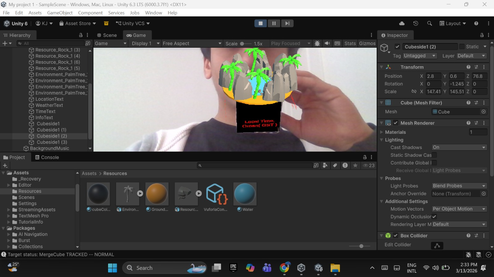
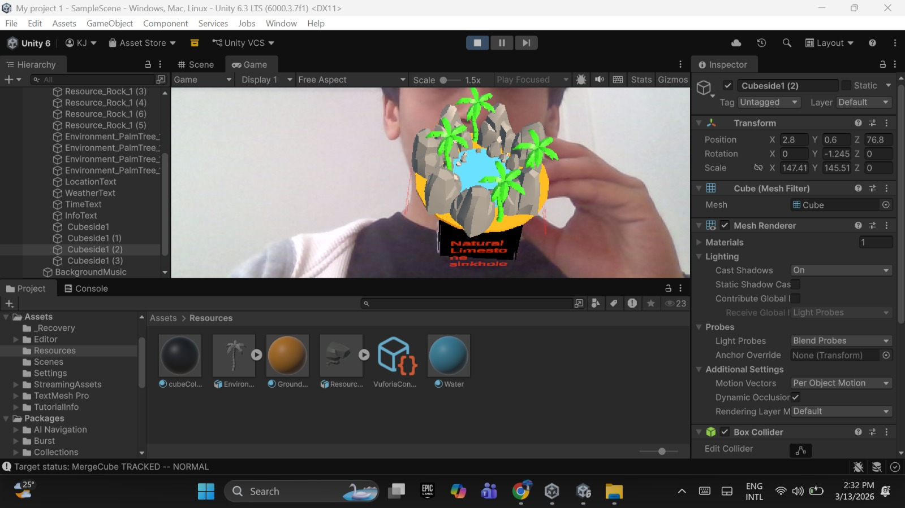
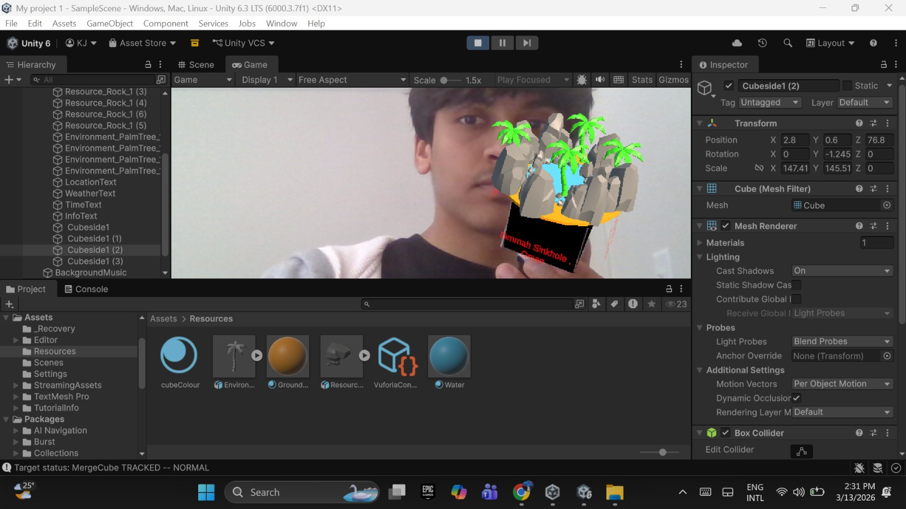
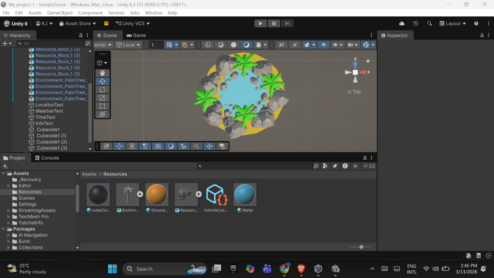

# AR Knick-Knack: Bimmah Sinkhole (Oman)

## Project Overview

This project is an **Augmented Reality knick-knack** developed using **Unity and Vuforia Engine**.  
The AR experience recreates a miniature representation of **Bimmah Sinkhole in Oman** that appears on top of a **Merge Cube** using **MultiTarget tracking**.

When the cube is detected by the phone camera, a 3D environment representing the sinkhole appears in real time.

The scene includes:

- Water representing the sinkhole
- Limestone rocks surrounding the hole
- Palm trees representing the natural vegetation
- Informational text displayed on each side of the cube
- Ambient background sound to simulate the natural environment

---

# Location: Bimmah Sinkhole

Bimmah Sinkhole is a natural limestone sinkhole located in Oman.  
It contains beautiful turquoise water and is surrounded by rock formations and palm trees.

This project recreates a simplified AR version of that environment.

---

# Technologies Used

- Unity Engine
- Vuforia Engine
- Merge Cube MultiTarget tracking
- TextMeshPro
- Poly Pizza 3D assets

---

# Development Process

## 1. Unity Project Setup
A new Unity project was created and Vuforia Engine was enabled.  
The Merge Cube database was imported and configured using a **MultiTarget object**.

## 2. Environment Creation
The sinkhole environment was constructed using:

- Ground surface
- Water object
- Rock models placed around the edge
- Palm tree models for vegetation

These elements were placed as children of the **MultiTarget object** so they move together with the cube.

## 3. Informational Cube Faces
Each side of the cube displays different information about the location including:

- Location name
- Weather conditions
- Local time
- Information about the sinkhole

TextMeshPro was used to display this information clearly on the cube faces.

## 4. Audio
An **Audio Source component** was added to play ambient sound when the cube is detected, creating a more immersive AR experience.

---

# Challenges

Several challenges were encountered during development:

- Correctly scaling the environment to fit on top of the cube
- Aligning models relative to the MultiTarget tracking object
- Managing Unity crashes and memory issues
- Ensuring text objects stayed aligned with the cube faces

These issues were solved through repositioning objects and frequent project saves.

---

# Future Improvements

Possible improvements for this project include:

- Real-time weather API integration
- Animated water effects
- Dynamic lighting based on time of day
- Interactive elements when rotating the cube

---

# Screenshots

## AR Demonstration

---

## Unity Scene View

This screenshot shows the sinkhole environment created inside Unity.

---

## Hierarchy Setup

This screenshot shows the Unity hierarchy where all environment objects are attached to the **MultiTarget object** so they move with the Merge Cube.

---

# 3D Model Sources

3D models used in this project were obtained from:

**Poly Pizza**

---

# Author

Kapish Jadiya  
Computer Science Student  
University of Cincinnati
